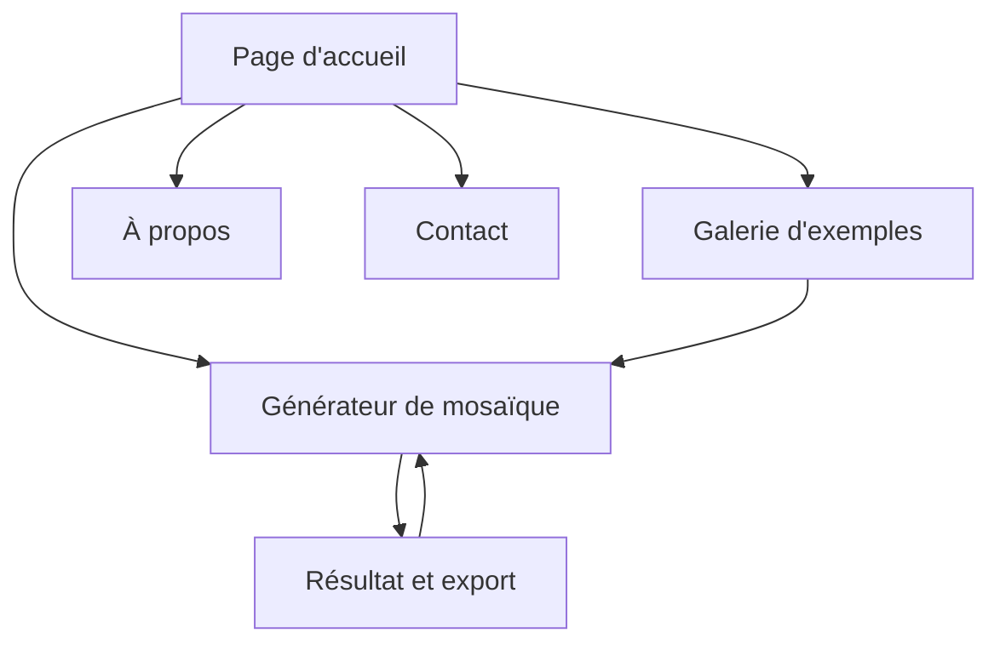

# Cubic Art - Document de Spécifications Produit

## 1. Vue d'ensemble du produit

Cubic Art est une application web créative et interactive qui transforme n'importe quelle image en mosaïque de style LEGO. L'application offre une expérience ludique et artistique où chaque image devient une composition de cubes colorés, permettant aux utilisateurs de redécouvrir leurs photos sous un angle artistique unique.

L'objectif principal est de démocratiser l'art de la mosaïque numérique en rendant la transformation d'images accessible à tous, tout en conservant une qualité visuelle professionnelle. Le produit vise le marché des créatifs, des amateurs d'art numérique et des passionnés de LEGO.

## 2. Fonctionnalités principales

### 2.1 Rôles utilisateurs

| Rôle | Méthode d'inscription | Permissions principales |
|------|----------------------|------------------------|
| Visiteur | Accès direct sans inscription | Peut utiliser le générateur de base, voir la galerie d'exemples |
| Utilisateur (futur) | Inscription par email | Accès complet, historique des créations, exports avancés |

### 2.2 Générateur de Mosaïque

**Spécifications techniques :**
- Baseplate LEGO 32x32 (référence officielle 3811)
- Utilisation exclusive de plates 1x1 (référence officielle 3024)
- Total de 1024 emplacements (32 × 32)
- Palette fixe de 47 couleurs LEGO officielles (2024)

**Fonctionnalités principales :**
- Upload d'image (formats : JPG, PNG, WebP)
- Transformation automatique en mosaïque LEGO 32x32
- Algorithme de quantification des couleurs vers la palette LEGO officielle
- Prévisualisation en temps réel avec grille 32x32
- Options d'export :
  - Téléchargement PNG haute résolution
  - Export SVG vectoriel avec grille
  - Liste détaillée des pièces nécessaires (couleur + quantité + réf. LEGO)

**Interface utilisateur :**
- Zone de drag & drop pour l'upload d'image
- Grande zone de prévisualisation centrale avec grille 32x32 visible
- Panneau d'informations : baseplate utilisée, nombre de couleurs, pièces requises
- Boutons d'export bien visibles et accessibles

### 2.3 Module fonctionnel

Notre application Cubic Art comprend les pages principales suivantes :

1. **Page d'accueil** : section héro avec taglines, navigation principale, démonstration interactive, section "Comment ça marche".
2. **Générateur de mosaïque** : zone d'upload d'images, transformation automatique en mosaïque 32x32 avec baseplate LEGO 3811 et plates 1x1 (réf. 3024), prévisualisation en temps réel, options d'export avec liste des pièces.
3. **Galerie d'exemples** : collection d'images transformées, filtres par style, aperçu rapide.
4. **Page À propos** : présentation du projet, mission artistique, informations sur l'équipe.
5. **Page Contact** : formulaire de feedback, informations de contact, support utilisateur.

### 2.3 Détails des pages

| Nom de la page | Nom du module | Description des fonctionnalités |
|----------------|---------------|----------------------------------|
| Page d'accueil | Section héro | Afficher les taglines principales, présentation visuelle avec animations, CTA vers le générateur |
| Page d'accueil | Navigation | Menu responsive avec liens vers toutes les sections, logo Cubic Art |
| Page d'accueil | Démonstration | Carrousel d'exemples de transformations, bouton "Essayer maintenant" |
| Page d'accueil | Comment ça marche | Étapes illustrées : Upload → Transformation → Téléchargement |
| Générateur | Zone d'upload | Glisser-déposer d'images, sélection de fichiers, prévisualisation de l'image source |
| Générateur | Moteur de transformation | Convertir l'image en mosaïque LEGO, algorithme de réduction de couleurs, placement automatique des briques |
| Générateur | Informations | Affichage des informations sur la baseplate 32x32 (réf. 3811), compteur des 1024 plates 1x1 utilisées, palette fixe de 47 couleurs LEGO |
| Générateur | Export | Télécharger en PNG ou SVG, options de résolution, partage social |
| Galerie | Collection d'exemples | Afficher les créations générées par le RPi5, images optimisées pour mosaïques |
| Galerie | Filtres | Trier par style, couleur dominante, complexité |
| À propos | Présentation | Mission du projet, inspiration artistique, vision créative |
| À propos | Équipe | Informations sur les créateurs, liens vers les profils |
| Contact | Formulaire | Champs pour nom, email, message, validation côté client |
| Contact | Support | FAQ, guides d'utilisation, résolution de problèmes |

## 3. Processus principal

**Flux utilisateur principal :**
1. L'utilisateur arrive sur la page d'accueil et découvre Cubic Art
2. Il clique sur "Essayer maintenant" ou navigue vers le générateur
3. Il uploade une image ou sélectionne un exemple de la galerie
4. Le système transforme automatiquement l'image en mosaïque LEGO
5. L'utilisateur peut ajuster les paramètres (taille, couleurs)
6. Il prévisualise le résultat en temps réel
7. Il télécharge sa création ou la partage

**Flux de découverte :**
1. L'utilisateur explore la galerie d'exemples
2. Il sélectionne une image qui l'inspire
3. Il peut directement l'utiliser comme base pour sa propre création

## 4. Design de l'interface utilisateur

### 4.1 Style de design

- **Couleurs principales :** Palette inspirée LEGO avec rouge (#E3000B), jaune (#FFD700), bleu (#0055BF), vert (#00A651)
- **Couleurs secondaires :** Gris moderne (#F8F9FA), blanc (#FFFFFF), noir doux (#2D3748)
- **Style des boutons :** Boutons arrondis avec effet 3D subtil, ombres portées, animations au survol
- **Typographie :** Police moderne sans-serif (Inter ou Poppins), tailles 16px-24px pour le corps, 32px-48px pour les titres
- **Style de mise en page :** Design basé sur des cartes, navigation supérieure fixe, grille responsive
- **Icônes et emojis :** Style minimaliste avec icônes Lucide, emojis pour les sections ludiques 🧱🎨✨

### 4.2 Aperçu du design des pages

| Nom de la page | Nom du module | Éléments UI |
|----------------|---------------|-------------|
| Page d'accueil | Section héro | Gradient coloré LEGO, typographie bold, animation de cubes flottants, CTA proéminent avec effet hover |
| Page d'accueil | Navigation | Barre fixe transparente, logo animé, menu hamburger mobile, transitions fluides |
| Générateur | Zone d'upload | Zone pointillée avec animation drag & drop, icône upload centrée, feedback visuel immédiat |
| Générateur | Prévisualisation | Grille de cubes colorés, zoom interactif, comparaison avant/après en slider |
| Galerie | Grille d'images | Layout masonry responsive, overlay avec informations, modal de prévisualisation |
| Contact | Formulaire | Champs avec validation temps réel, design épuré, bouton d'envoi avec animation de chargement |

### 4.3 Responsivité

L'application est conçue avec une approche desktop-first mais entièrement adaptée mobile. L'interface s'adapte automatiquement aux écrans tactiles avec des zones de touch optimisées (minimum 44px), navigation par gestes, et performance optimisée pour les appareils mobiles. Les grilles passent de 3-4 colonnes sur desktop à 1-2 colonnes sur mobile.