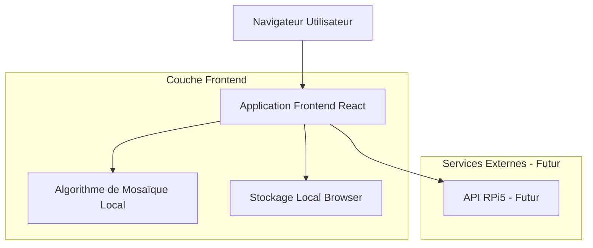
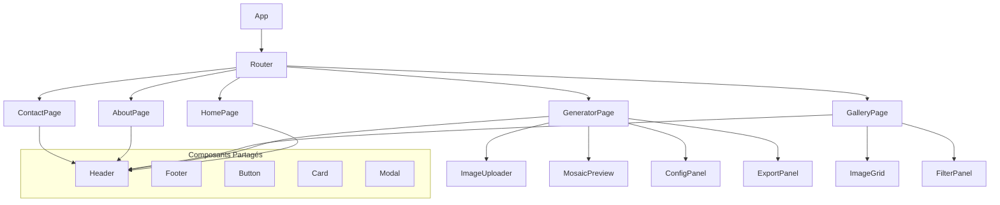
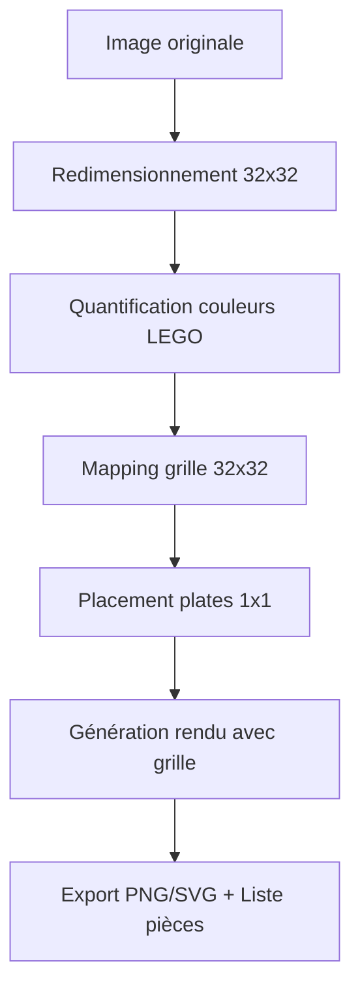
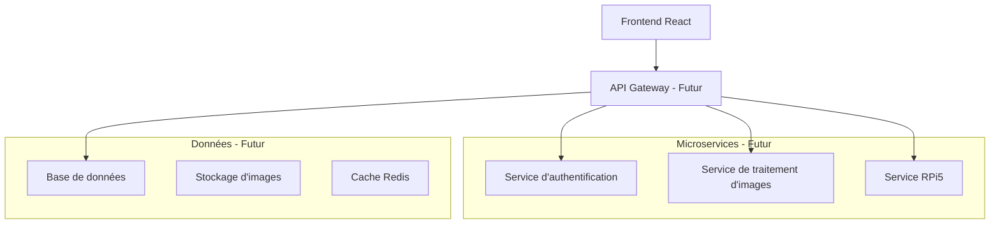

# Cubic Art - Document d'Architecture Technique

## 1. Conception de l'architecture



## 2. Description des technologies

* Frontend: React\@18 + TypeScript\@5 + Vite\@5 + Tailwind CSS\@3 + shadcn/ui

* Gestion d'état: Zustand\@4

* Validation: Zod\@3

* Gestionnaire de paquets: PNPM

* Backend: Aucun (MVP entièrement côté client)

## 3. Définitions des routes

| Route      | Objectif                                                                |
| ---------- | ----------------------------------------------------------------------- |
| /          | Page d'accueil avec présentation et démonstration de Cubic Art          |
| /generator | Générateur de mosaïque principal avec upload et transformation d'images |
| /gallery   | Galerie d'exemples de mosaïques créées et images de démonstration       |
| /about     | Page à propos avec informations sur le projet et l'équipe               |
| /contact   | Formulaire de contact et support utilisateur                            |

## 4. Définitions des types TypeScript

### 4.1 Types principaux

```typescript
// Types pour la gestion des images
interface ImageData {
  id: string;
  name: string;
  originalUrl: string;
  mosaicUrl?: string;
  width: number;
  height: number;
  createdAt: Date;
}

// Configuration de la mosaïque
interface MosaicConfig {
  size: 32; // Fixe - baseplate 32x32 (réf. LEGO 3811)
  colorPalette: LegoColor[]; // 47 couleurs LEGO officielles
  brickType: '1x1'; // Pièces 1x1 uniquement (réf. LEGO 3024)
}

// Couleurs LEGO disponibles
interface LegoColor {
  id: number;
  name: string;
  hex: string;
  rgb: [number, number, number];
}

// Résultat de la transformation
interface MosaicResult {
  imageData: ImageData;
  config: MosaicConfig;
  grid: LegoColor[][];
  exportFormats: ('png' | 'svg' | 'json')[];
  processingTime: number;
}

// État de l'application
interface AppState {
  currentImage: ImageData | null;
  mosaicResult: MosaicResult | null;
  isProcessing: boolean;
  config: MosaicConfig;
  gallery: ImageData[];
}
```

## 5. Architecture des composants



## 6. Modèle de données

### 6.1 Stockage local (LocalStorage)

```typescript
// Structure de stockage local
interface LocalStorageData {
  userPreferences: {
    defaultConfig: MosaicConfig;
    theme: 'light' | 'dark';
    language: 'fr' | 'en';
  };
  recentImages: ImageData[];
  favoriteResults: MosaicResult[];
  appVersion: string;
}
```

### 6.2 Palette de couleurs LEGO officielles (47 couleurs)

```typescript
const LEGO_COLORS: LegoColor[] = [
  // Couleurs neutres
  { id: 1, name: 'White', hex: '#FFFFFF', rgb: [255, 255, 255] },
  { id: 11, name: 'Black', hex: '#05131D', rgb: [5, 19, 29] },
  { id: 85, name: 'Dark Bluish Gray', hex: '#6C6E68', rgb: [108, 110, 104] },
  { id: 86, name: 'Light Bluish Gray', hex: '#9BA19D', rgb: [155, 161, 157] },
  
  // Couleurs primaires
  { id: 5, name: 'Red', hex: '#C91A09', rgb: [201, 26, 9] },
  { id: 7, name: 'Blue', hex: '#0055BF', rgb: [0, 85, 191] },
  { id: 6, name: 'Green', hex: '#237841', rgb: [35, 120, 65] },
  { id: 3, name: 'Yellow', hex: '#F2CD37', rgb: [242, 205, 55] },
  { id: 4, name: 'Orange', hex: '#FC7C02', rgb: [252, 124, 2] },
  
  // Couleurs brunes et tan
  { id: 88, name: 'Reddish Brown', hex: '#582A12', rgb: [88, 42, 18] },
  { id: 120, name: 'Dark Brown', hex: '#5F3109', rgb: [95, 49, 9] },
  { id: 2, name: 'Tan', hex: '#E4CD9E', rgb: [228, 205, 158] },
  { id: 90, name: 'Light Nougat', hex: '#F6D7B3', rgb: [246, 215, 179] },
  { id: 28, name: 'Nougat', hex: '#D09168', rgb: [208, 145, 104] },
  { id: 150, name: 'Medium Nougat', hex: '#AA7D55', rgb: [170, 125, 85] },
  { id: 69, name: 'Dark Tan', hex: '#958A73', rgb: [149, 138, 115] },
  { id: 240, name: 'Medium Brown', hex: '#897D62', rgb: [137, 125, 98] },
  { id: 241, name: 'Medium Tan', hex: '#CC9C2B', rgb: [204, 156, 43] },
  { id: 168, name: 'Umber', hex: '#6A4C36', rgb: [106, 76, 54] },
  { id: 169, name: 'Sienna', hex: '#915C3C', rgb: [145, 92, 60] },
  
  // Nouvelles couleurs 2024
  { id: 167, name: 'Reddish Orange', hex: '#CA4C0B', rgb: [202, 76, 11] },
  
  // Couleurs vertes
  { id: 34, name: 'Lime', hex: '#A3C312', rgb: [163, 195, 18] },
  { id: 36, name: 'Bright Green', hex: '#10CB31', rgb: [16, 203, 49] },
  { id: 48, name: 'Sand Green', hex: '#819E87', rgb: [129, 158, 135] },
  { id: 80, name: 'Dark Green', hex: '#184632', rgb: [24, 70, 50] },
  { id: 155, name: 'Olive Green', hex: '#9B9A5A', rgb: [155, 154, 90] },
  { id: 158, name: 'Yellowish Green', hex: '#DFEEA5', rgb: [223, 238, 165] },
  
  // Couleurs bleues
  { id: 42, name: 'Medium Blue', hex: '#5A93DB', rgb: [90, 147, 219] },
  { id: 63, name: 'Dark Blue', hex: '#143044', rgb: [20, 48, 68] },
  { id: 55, name: 'Sand Blue', hex: '#6074A1', rgb: [96, 116, 161] },
  { id: 105, name: 'Bright Light Blue', hex: '#9FC3E9', rgb: [159, 195, 233] },
  { id: 153, name: 'Dark Azure', hex: '#3592C3', rgb: [53, 146, 195] },
  { id: 156, name: 'Medium Azure', hex: '#36AEBF', rgb: [54, 174, 191] },
  { id: 152, name: 'Light Aqua', hex: '#B3D7D1', rgb: [179, 215, 209] },
  { id: 39, name: 'Dark Turquoise', hex: '#008F9B', rgb: [0, 143, 155] },
  
  // Couleurs violettes et roses
  { id: 220, name: 'Coral', hex: '#FF698F', rgb: [255, 105, 143] },
  { id: 59, name: 'Dark Red', hex: '#720E0F', rgb: [114, 14, 15] },
  
  // Couleurs jaunes spéciales
  { id: 103, name: 'Bright Light Yellow', hex: '#FFF03A', rgb: [255, 240, 58] },
  { id: 110, name: 'Bright Light Orange', hex: '#F8BB3D', rgb: [248, 187, 61] },
  { id: 236, name: 'Neon Yellow', hex: '#FFFF00', rgb: [255, 255, 0] },
  
  // Couleurs spéciales récentes
  { id: 68, name: 'Dark Orange', hex: '#A95500', rgb: [169, 85, 0] },
];
```

> **Note :** Cette palette contient les 47 couleurs solides LEGO officielles disponibles en 2024, incluant les trois nouvelles couleurs ajoutées en janvier 2024 : Reddish Orange, Umber et Sienna.

## 7. Algorithme de transformation

### 7.1 Pipeline de traitement pour baseplate 32x32



1. **Redimensionnement fixe** : Redimensionner l'image à exactement 32x32 pixels
2. **Quantification des couleurs LEGO** : Mapper chaque pixel vers la couleur LEGO la plus proche parmi les 47 disponibles
3. **Mapping sur grille 32x32** : Chaque pixel correspond à une position sur la baseplate
4. **Placement des plates 1x1** : Assigner une plate 1x1 (réf. 3024) à chaque position
5. **Génération du rendu** : Créer la visualisation avec grille visible et effet 3D des plates
6. **Export complet** : Générer PNG, SVG et liste détaillée des 1024 pièces nécessaires

```typescript
// Étapes de transformation d'image en mosaïque
interface ProcessingPipeline {
  1: 'imageResize';     // Redimensionner selon la grille
  2: 'colorQuantization'; // Réduire les couleurs à la palette LEGO
  3: 'gridMapping';     // Mapper chaque pixel à une couleur LEGO
  4: 'brickPlacement';  // Optimiser le placement des briques
  5: 'renderGeneration'; // Générer le rendu final
}
```

### 7.2 Fonctions utilitaires

````typescript
// Fonctions utilitaires pour le traitement d'image 32x32
class ImageProcessor {
  static resizeToBaseplate(image: HTMLImageElement): ImageData {
    // Redimensionnement fixe à 32x32 pixels pour baseplate LEGO 3811
    const canvas = document.createElement('canvas');
    canvas.width = 32;
    canvas.height = 32;
    const ctx = canvas.getContext('2d')!;
    ctx.drawImage(image, 0, 0, 32, 32);
    return ctx.getImageData(0, 0, 32, 32);
  }
  
  static quantizeToLegoColors(imageData: ImageData): ImageData {
    // Mapper chaque pixel vers la couleur LEGO la plus proche (Delta E)
    const data = new Uint8ClampedArray(imageData.data);
    for (let i = 0; i < data.length; i += 4) {
      const [r, g, b] = [data[i], data[i + 1], data[i + 2]];
      const closestColor = this.findClosestLegoColor(r, g, b);
      [data[i], data[i + 1], data[i + 2]] = closestColor.rgb;
    }
    return new ImageData(data, 32, 32);
  }
  
  static generateLegoMosaic(imageData: ImageData): MosaicResult {
    // Génération de la mosaïque 32x32 avec plates 1x1
    const plates: Array<{x: number, y: number, color: LegoColor}> = [];
    const data = imageData.data;
    
    for (let y = 0; y < 32; y++) {
      for (let x = 0; x < 32; x++) {
        const index = (y * 32 + x) * 4;
        const [r, g, b] = [data[index], data[index + 1], data[index + 2]];
        const color = this.findLegoColorByRGB(r, g, b);
        plates.push({ x, y, color });
      }
    }
    
    return {
      plates,
      baseplate: { ref: '3811', size: '32x32' },
      totalPieces: 1024,
      piecesList: this.generatePiecesList(plates)
    };
  }
  
  static findClosestLegoColor(r: number, g: number, b: number): LegoColor {
    // Algorithme Delta E pour trouver la couleur LEGO la plus proche
    let minDistance = Infinity;
    let closestColor = LEGO_COLORS[0];
    
    for (const color of LEGO_COLORS) {
      const distance = this.calculateColorDistance([r, g, b], color.rgb);
      if (distance < minDistance) {
        minDistance = distance;
        closestColor = color;
      }
    }
    
    return closestColor;
  }
  
  static generatePiecesList(plates: Array<{color: LegoColor}>): Record<string, number> {
    // Génère la liste des pièces nécessaires par couleur
    const pieceCount: Record<string, number> = {};
    plates.forEach(plate => {
      const colorName = plate.color.name;
      pieceCount[colorName] = (pieceCount[colorName] || 0) + 1;
    });
    return pieceCount;
  }
  
  static exportToPNG(mosaicResult: MosaicResult): Blob {
    // Export PNG avec grille visible et effet 3D
  }
  
  static exportToSVG(mosaicResult: MosaicResult): string {
    // Export SVG vectoriel avec définitions des plates 1x1
  }
}

// Utilitaires pour le traitement d'images
interface ImageUtils {
  resizeImage(file: File, maxWidth: number, maxHeight: number): Promise<HTMLCanvasElement>;
  extractColors(canvas: HTMLCanvasElement): RGB[];
  findClosestLegoColor(rgb: RGB, palette: LegoColor[]): LegoColor;
  generateMosaicGrid(colors: LegoColor[][], config: MosaicConfig): LegoColor[][];
  exportToSVG(grid: LegoColor[][], config: MosaicConfig): string;
  exportToPNG(grid: LegoColor[][], config: MosaicConfig): Blob;
}```

## 8. Extensibilité future

### 8.1 Intégration RPi5

```typescript
// API future pour le Raspberry Pi 5
interface RPi5API {
  generateExampleImage(style: 'flat' | 'simplified'): Promise<ImageData>;
  optimizeForMosaic(imageUrl: string): Promise<ImageData>;
  getAvailableStyles(): Promise<string[]>;
}
````

### 8.2 Fonctionnalités avancées

* **Authentification utilisateur** : Système de comptes pour sauvegarder les créations

* **Historique des créations** : Base de données des mosaïques créées

* **Partage social** : Intégration avec les réseaux sociaux

* **Export avancé** : Formats supplémentaires (PDF, instructions de construction)

* **Collaboration** : Partage et modification collaborative de mosaïques

* **API publique** : Endpoints pour intégration tierce

### 8.3 Architecture évolutive



